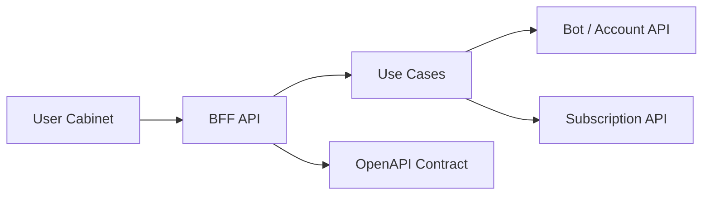

# NKVPN BFF API

Public engineering case study for the backend-for-frontend API behind a VPN SaaS user cabinet. The production BFF coordinates user-facing flows across subscription services, bot APIs, auth/account logic, and support-related data.

This repository demonstrates how the frontend-facing contract is stabilized without exposing internal service topology or private credentials.

## Problem

A user cabinet should feel simple: show subscription status, traffic, devices, and account actions. Internally, that data can come from several systems that evolve independently.

Without a BFF, the frontend becomes coupled to internal APIs, duplicates error handling, and leaks service boundaries into UI code.

## Solution

The BFF owns frontend-facing contracts and adapts downstream services into stable view models:

- controllers expose UI-oriented endpoints;
- use cases coordinate downstream calls;
- clients attach internal credentials server-side;
- errors are normalized before reaching the frontend;
- OpenAPI documents the contract consumed by UI teams.

## Key Features

- Stable facade for the user cabinet.
- Downstream timeout/error normalization.
- API key protection for internal service calls.
- Frontend-ready subscription view contract.
- Health endpoint for operational checks.
- Unit tests for downstream error handling.

## Architecture



The BFF should stay thin: it coordinates and shapes responses, but does not become a duplicate domain model.

## Tech Stack

- NestJS, TypeScript.
- Axios/RxJS patterns in the production service.
- class-validator/Joi-style validation.
- OpenAPI for contract documentation.
- Vitest and GitHub Actions for tests/CI.

## Engineering Highlights

- `docs/adr/0001-bff-owns-frontend-contracts.md` explains why the BFF owns UI contracts.
- `docs/openapi.yaml` documents the public-safe endpoint shape.
- `examples/api-client/downstreamClient.ts` demonstrates timeout-aware downstream calls.
- `tests/downstreamClient.test.ts` covers successful responses and non-2xx normalization.
- `docs/production.md` covers reliability, security, observability, and contract discipline.

## Production Considerations

The BFF is a reliability boundary between user experience and internal services:

- explicit downstream timeouts;
- normalized frontend-safe error codes;
- dependency-specific monitoring;
- correlation IDs across service calls;
- no internal API keys exposed to browser code;
- compatibility discipline around response shapes.

## Public vs Private

Included in this repository:

- BFF architecture notes;
- OpenAPI contract;
- downstream client example;
- tests and CI;
- ADR, production notes, and roadmap.

Excluded from this repository:

- internal API keys;
- production URLs;
- full endpoint mapping;
- user identifiers;
- request logs;
- private auth/account flows.

## Local Development

```bash
npm install
npm run typecheck
npm test
```
