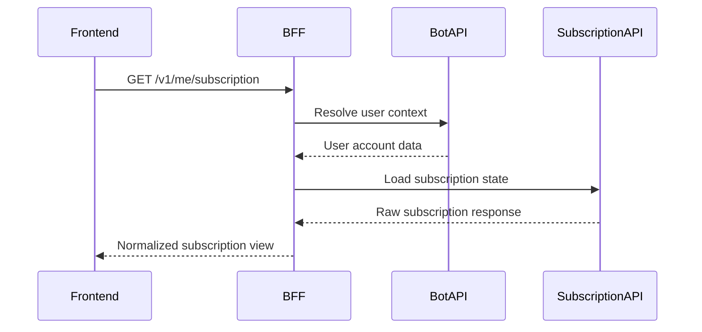

# Architecture

```text
User Cabinet -> BFF Controller -> Use Case -> Downstream Client
                         |             |
                         v             v
                    Validation     Bot/Subscription APIs
```

## Notes

- The BFF owns frontend-facing contracts.
- Downstream API contracts can change without breaking the user cabinet.
- Timeouts and failures are normalized before reaching the frontend.
- Internal API keys are attached server-side only.

## Sequence: Subscription View


